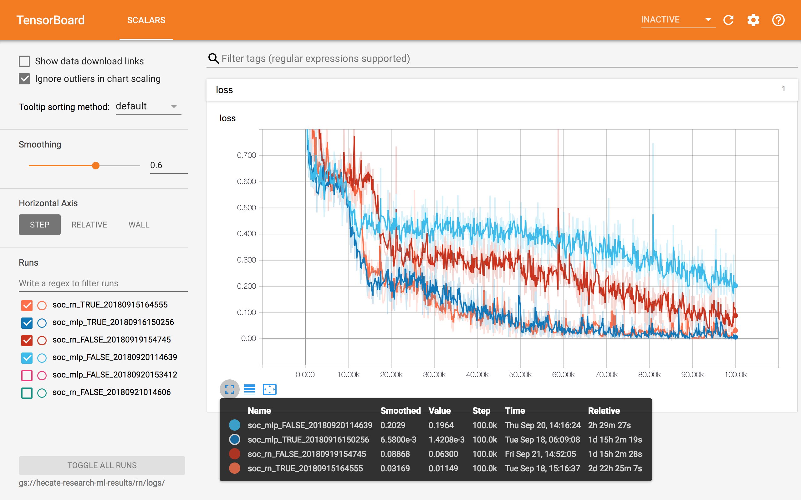
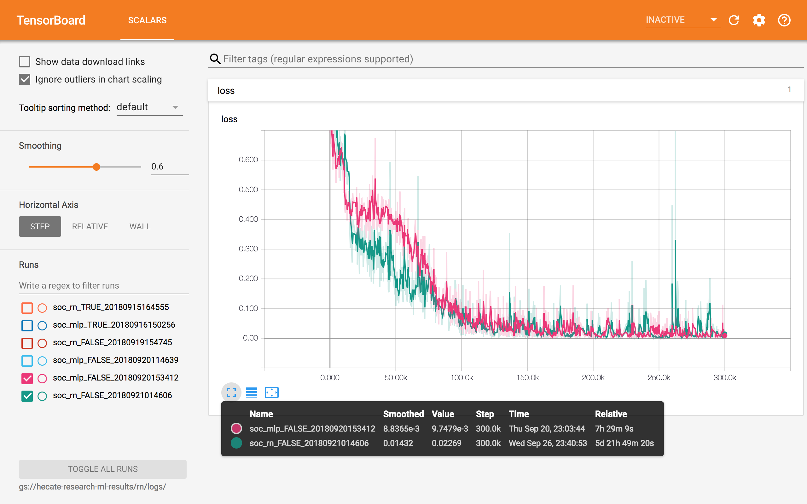

# Replicated "A simple neural network module for relational reasoning"

Only experimented on Sort-of-CLEVR.

## Source Files

Use *dataset_sort_of_clevr.py* to build the dataset. Each image along with its questions & answers are kept as a TFRecord under *result_dir_path*. Because I was lazy, the two shapes in the generated dataset are square and triangle. All images are guaranteed to be different in one generating session. After the script completes its job, please extract the testing subset manually.

* **image_size**: size of generated image, model_sort_of_clevr requires the image size to be 71.
* **num_images**: number of images to be generated.
* **num_non_relational_per_image**: number of non-relational questions per image.
* **num_relational_per_image**: number of relational questions per image.
* **result_dir_path**: path to a directory for keeping generated tfrecords.
* **shape_size**: size of shape (bounding box) on generated images.

```
python -m rn.dataset_sort_of_clevr \
    --image_size=75 \
    --num_images=10000 \
    --num_non_relational_per_image=10 \
    --num_relational_per_image=10 \
    --result_dir_path=/path/to/output/dir/ \
    --shape_size=11
```

Once the dataset is generated, we can do random checking on it.

```
python -m rn.dataset_sort_of_clevr \
    --source_dir_path=/path/to/sort_of_clevr/dir/

                                                                           |
                                                  66666666666              |
                                                  66666666666              |
                                                  66666666666              |
                                                  66666666666              |
                                                  66666666666              |
                                                  66666666666              |
                                                  66666666666              |
                                                  66666666666              |
                                                  66666666666              |
                                                  66666666666              |
                                                  66666666666              |
                                                                           |
                                                                           |
                                                                           |
                11111111111                                                |
                11111111111                                                |
                11111111111                                                |
                11111111111                                                |
                11111111111                                                |
                11111111111                                                |
                11111111111                                                |
                11111111111                                                |
                11111111111                                                |
                11111111111                                                |
                11111111111                                                |
                                                                           |
                                                                           |
                                                                           |
                                                                           |
                                                                           |
                                                                           |
                                                                           |
                                                                           |
                                                                           |
                                                                           |
                                                                           |
                                                                           |
                                                                           |
                                                       33333333333         |
                                                       33333333333         |
                                                       33333333333         |
                                                       33333333333         |
                                                       33333333333         |
                              2                        33333333333         |
                              22                       33333333333         |
                              222                      33333333333         |
                              2222                     33333333333         |
                              22222                    33333333333         |
                              222222                   33333333333         |
                              2222222                          4           |
                              22222222                         44          |
                              222222222    55555555555         444         |
                              2222222222   55555555555         4444        |
                                           55555555555         44444       |
                                           55555555555         444444      |
                                           55555555555         4444444     |
                                           55555555555         44444444    |
                                           55555555555         444444444   |
                                           55555555555         4444444444  |
                                           55555555555                     |
                                           55555555555                     |
                                           55555555555                     |
                                                                           |
                                                                           |
                                                                           |
                                                                           |
                                                                           |
                                                                           |
                                                                           |
                                                                           |
                                                                           |
                                                                           |
                                                                           |
                                                                           |
-------------------------------------^-------------------------------------
what is the shape of the object that is closest to the 4 object? square

```

To train a the model, use experiment_sort_of_clevr.py.

* **data_path**: path to a directory which contains training set of sort-of-celvr.
* **ckpt_path**: path to a directory to keep checkpoints.
* **logs_path**: path to a directory to keep training log (loss).
* **type**: type of model, can be 'rn' or 'mlp'.
* **tag_positions**: tag positions (x&y) in the model.
* **eval**: a boolean value. set it to False for training.
* **batch_size**: size of mini-batch for training process.
* **max_training_steps**: training will stop once training_stop exceeds the specified number.

```
python -m rn.experiment_sort_of_clevr \
    --data_path=$(TRAINING_DATASET_PATH) \
    --ckpt_path=$(LOGS_ROOT)/ckpt/$(MODEL_TYPE)_$(TAG_POSITIONS)_$(TIMESTAMP)/ \
    --logs_path=$(LOGS_ROOT)/logs/$(MODEL_TYPE)_$(TAG_POSITIONS)_$(TIMESTAMP)/ \
    --type=$(MODEL_TYPE) \
    --tag_positions=$(TAG_POSITIONS) \
    --eval=False \
    --batch_size=64 \
    --max_training_steps=300000
```

Once we have trained checkpoints, we can evaluate it on test dataset and get number of correctly answered questions (both relational & non-relational).

* **data_path**: path to a directory which contains test set of sort-of-clevr.
* **ckpt_path**: path to a directory which contains the checkpoint.
* **type**: type of the model for evaluation. the type must match the checkpoint (which was trained with the same type).
* **eval**: a boolean value. set it to True for evaluation.

```
python -m rn.experiment_sort_of_clevr \
    --data_path=$(TEST_DATASET_PATH) \
    --ckpt_path=./ckpt/$(CKPT_NAME)/ \
    --type=$(MODEL_TYPE) \
    --eval=True
```

## Experiments with Position Tag

I found some implementations (e.g. https://github.com/kimhc6028/relational-networks) does not tag positions to mlp model. However, I do not think position tag is part of RN. So the experiments were done with different setups.

For all the experiments, RN perform slightly better. But not as good as paper's result. And the position tag play an important role on both model types.

If both rn & mlp models are tagged with positions, the performance difference is minor (compared to figure 4 of supplementary material). Both experiments below were trained in 100k steps.

| model \ questions | non-relational (2,000) | relational (2,000) |
|-------------------|------------------------|--------------------|
| CNN + RN          | 1992                   | 1863               |
| CNN + MLP         | 1995                   | 1807               |

## Experiments without Position Tag

If both rn & mlp models are not tagged with positions, the performance difference is larger. When both models were trained in 100k steps:

| model \ questions | non-relational (2,000) | relational (2,000) |
|-------------------|------------------------|--------------------|
| CNN + RN          | 1759                   | 1643               |
| CNN + MLP         | 1430                   | 1520               |

When both models were trained in 300k steps:

| model \ questions | non-relational (2,000) | relational (2,000) |
|-------------------|------------------------|--------------------|
| CNN + RN          | 1894                   | 1663               |
| CNN + MLP         | 1415                   | 1482               |

# Training Time & Loss

Trained with or without tagged positions (TRUE/FALSE in the name of checkpoints).


Trained without tagged positions in 300k steps.


# TODO

- [ ] find reason why the performance of rn is not surpass mlp's.
